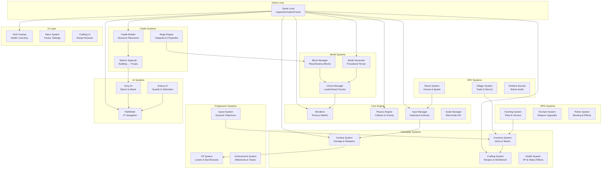
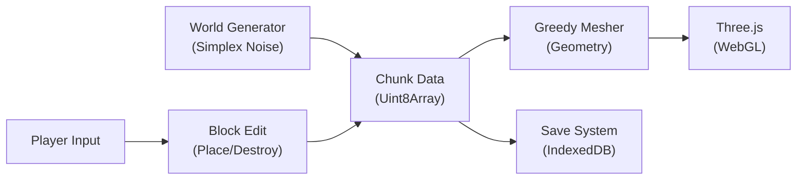
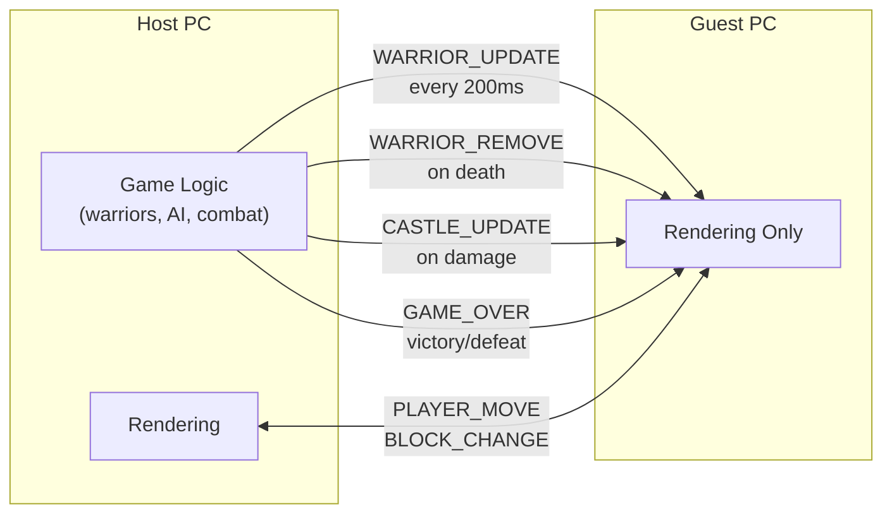

# Architecture Document — Mattis Abenteuer

## Design Philosophy

| Principle | Description |
|---|---|
| **Component-based (ECS)** | Entities are composed of data components; systems process them independently |
| **Chunk-based world** | World divided into fixed-size chunks for efficient rendering and memory |
| **Event-driven** | Systems communicate via an event bus — loose coupling, easy extension |
| **Data-oriented** | Game state is plain data; logic lives in systems, not in entity classes |
| **Progressive loading** | Only load/render chunks near the player; unload distant ones |

## System Architecture



## Technology Choices

| Layer | Choice | Rationale |
|---|---|---|
| **Language** | TypeScript | Type safety, IDE support, learning-friendly for a father-son project |
| **3D Engine** | Three.js | Most mature WebGL library, huge community, great docs |
| **Build Tool** | Vite | Fast HMR, native ES modules, simple config |
| **Testing** | Vitest | Native Vite integration, fast, Jest-compatible API |
| **Linting** | ESLint + Prettier | Standard TS tooling, auto-format on save |
| **Architecture** | ECS Pattern | Scalable for game entities, decoupled systems, easy to test |
| **World Gen** | Simplex Noise | Fast, good terrain variety, well-documented algorithm |

### Why Three.js over Alternatives?

| Alternative | Reason for Rejection |
|---|---|
| Babylon.js | Heavier, more complex API — overkill for a voxel game |
| PlayCanvas | Editor-centric, less control over raw rendering |
| Unity WebGL | Huge bundle size, C# not TypeScript |
| Custom WebGL | Too low-level, slow to develop |

## Data Architecture

### Block Types

```typescript
enum BlockType {
  AIR = 0,
  DIRT = 1,
  GRASS = 2,
  STONE = 3,
  WOOD_OAK = 4,
  WOOD_BIRCH = 5,
  IRON_ORE = 6,
  GOLD_ORE = 7,
  CRYSTAL = 8,
  SAND = 9,
  WATER = 10,
  COBBLESTONE = 11,
  BRICK = 12,
  // ... extends to 255 block types
}
```

### Chunk Data

```typescript
interface Chunk {
  x: number;          // chunk coord
  z: number;          // chunk coord
  blocks: Uint8Array; // CHUNK_SIZE³ flat array
  mesh: THREE.Mesh;   // rendered geometry
  dirty: boolean;     // needs re-meshing
}
```

### Data Flow



### Data Stores

| Store | Technology | Purpose |
|---|---|---|
| **Chunk data** | In-memory `Map<string, Chunk>` | Active world state |
| **Save files** | IndexedDB | Persistent game saves |
| **Assets** | Static files (`/public/`) | Textures, sounds, models |
| **Config** | `.env` + runtime | Game settings, debug flags |

## Networking Architecture

**Design**: Host-authoritative co-op over WebRTC (PeerJS). The host runs all game logic; the guest receives state updates and sends player input.



| Component | Technology | Notes |
|---|---|---|
| **Signaling** | PeerJS cloud (`0.peerjs.com`) | Both PCs need internet for initial handshake |
| **Data channel** | WebRTC P2P | Game data flows directly between PCs |
| **Connection** | Room codes | Host generates code, guest enters it |
| **Tick rate** | 100ms player sync, 200ms warrior sync | Positions are lerped on guest |

## Security Architecture

| Concern | Approach |
|---|---|
| **Save integrity** | JSON schema validation on load |
| **Dependencies** | Dependabot + `npm audit` in CI |
| **Secrets** | No secrets needed — purely client-side |
| **Code quality** | ESLint security rules, no `eval()` |
| **Multiplayer** | WebRTC P2P — no server-side auth; trust model is LAN/friend-only |

## Deployment Topology

```
mattis-abenteuer/
├── Dev Server              Vite dev server (0.0.0.0:3001, LAN accessible)
├── Build Output            Static files in dist/
├── CI/CD                   GitHub Actions (lint + test + build)
└── Multiplayer             PeerJS WebRTC P2P (host generates room code)
```

No cloud deployment — the game runs entirely in the browser.
LAN multiplayer: Player 2 opens `http://<host-ip>:3001` and joins via room code.
Future consideration: Itch.io or GitHub Pages for distribution.
