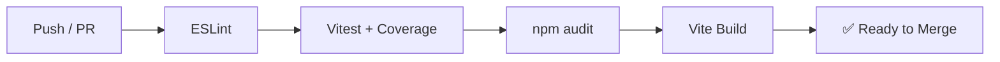

# Software Development Lifecycle — Mattis Abenteuer

## Development Philosophy

This project follows a **learn-by-building** approach. It's a father-son project that prioritizes:

1. **Fun first** — Every feature should make the game more enjoyable
2. **Incremental progress** — Small, working increments over big-bang releases
3. **Quality code** — Clean, readable code that teaches good practices
4. **Automated safety nets** — CI/CD catches mistakes early

## Git Branching Strategy

**Trunk-based development** with short-lived feature branches:

```
main ─────────────────────────────────────────────►
  \                    /
   └─ feature/MA-001-voxel-engine ─┘   (squash merge)
        \              /
         └─ feature/MA-002-player-controls ─┘
```

### Branch Naming

```
feature/MA-XXX-short-description    # New features
fix/MA-XXX-short-description        # Bug fixes
docs/MA-XXX-short-description       # Documentation only
chore/MA-XXX-short-description      # Maintenance tasks
```

### Merge Rules

- All branches merge to `main` via **squash merge**
- Branch must pass CI before merge
- Self-review is acceptable (small team)

## CI/CD Pipeline



### Pipeline Details

| Stage | Tool | Failure Action |
|---|---|---|
| **Lint** | ESLint + Prettier | Block merge |
| **Test** | Vitest with coverage | Block if < 80% coverage |
| **Security** | npm audit | Warn (non-blocking) |
| **Build** | `tsc && vite build` | Block merge |

### Workflow File

`.github/workflows/ci.yml` — runs on push to `main` and all PRs.

## Testing Strategy

### Test Types

| Type | Tool | Location | Coverage Target |
|---|---|---|---|
| **Unit** | Vitest | `src/__tests__/` | > 80% |
| **Integration** | Vitest | `src/__tests__/integration/` | Key flows covered |
| **Visual** | Manual | Browser | Spot-check rendering |

### What to Test

| System | Test Focus |
|---|---|
| **World Gen** | Deterministic output for given seed, valid block types |
| **Crafting** | Recipe lookup, ingredient validation, inventory mutation |
| **Combat** | Damage calculation, range checks, HP boundaries |
| **Castle** | Building placement, spawner logic, HP tracking |
| **AI** | Pathfinding correctness, state transitions |
| **Inventory** | Stack limits, add/remove, serialization |

### What NOT to Test

- Three.js rendering internals
- Browser APIs (canvas, WebGL)
- Third-party library behavior

### Running Tests

```bash
npm run test            # Single run with coverage
npm run test:watch      # Watch mode during development
make test               # Via Makefile
```

## Engineering Standards

### Code Style

| Tool | Config File | Purpose |
|---|---|---|
| **ESLint** | `.eslintrc.json` | Catch bugs, enforce patterns |
| **Prettier** | `.prettierrc` | Consistent formatting |
| **TypeScript** | `tsconfig.json` | Strict type checking |

### Naming Conventions

| Element | Convention | Example |
|---|---|---|
| Variables | `camelCase` | `chunkSize`, `playerHealth` |
| Functions | `camelCase` | `generateTerrain()`, `spawnWarrior()` |
| Types/Interfaces | `PascalCase` | `ChunkData`, `CraftingRecipe` |
| Enums | `PascalCase` | `BlockType`, `WarriorType` |
| Constants | `UPPER_SNAKE_CASE` | `CHUNK_SIZE`, `MAX_HEALTH` |
| Files | `camelCase` | `chunkManager.ts`, `craftingSystem.ts` |
| Test files | `*.test.ts` | `chunkManager.test.ts` |

### Pre-commit Hooks

Configured via `.pre-commit-config.yaml`:

- Trailing whitespace removal
- End-of-file fixer
- YAML/JSON validation
- ESLint check
- Gitleaks (secret scanning)
- Commitlint (conventional commits)

## Documentation Standards

### 4-Document Structure

| Document | Purpose | Updated When |
|---|---|---|
| `docs/PRD.md` | What we're building and why | New features, roadmap changes |
| `docs/ARCH.md` | How it's designed | Architecture changes |
| `docs/SPEC.md` | Technical details | New systems, model changes |
| `docs/SDLC.md` | How we work | Process changes |

### Supplementary Docs

| Document | Purpose |
|---|---|
| `AGENT.md` | Quick reference for AI agents |
| `CONTRIBUTING.md` | How to contribute |
| `SECURITY.md` | Security policy |
| `README.md` | Project overview + quick start |

### Code Documentation

- **JSDoc** for public functions and complex logic
- **Inline comments** for non-obvious algorithms
- **No comments** for self-explanatory code

## Commit Convention

[Conventional Commits](https://www.conventionalcommits.org/) enforced by commitlint:

```
feat(world): add simplex noise terrain generation
fix(combat): correct damage calculation for armor
docs(spec): add catapult mechanics specification
chore(deps): update three.js to v0.173
test(crafting): add recipe validation tests
refactor(engine): extract game loop into class
perf(render): implement greedy meshing algorithm
```

## Release Management

### Versioning

Semantic Versioning (`MAJOR.MINOR.PATCH`):

- **0.1.x** — Phase 1 (Foundation)
- **0.2.x** — Phase 2 (Survival & Crafting)
- **0.3.x** — Phase 3 (Castle Warfare)
- **1.0.0** — First playable release

### Release Process

1. All tests pass on `main`
2. Update version in `package.json`
3. Create git tag: `git tag v0.x.x`
4. Push tag: `git push origin v0.x.x`
5. GitHub Release with changelog
