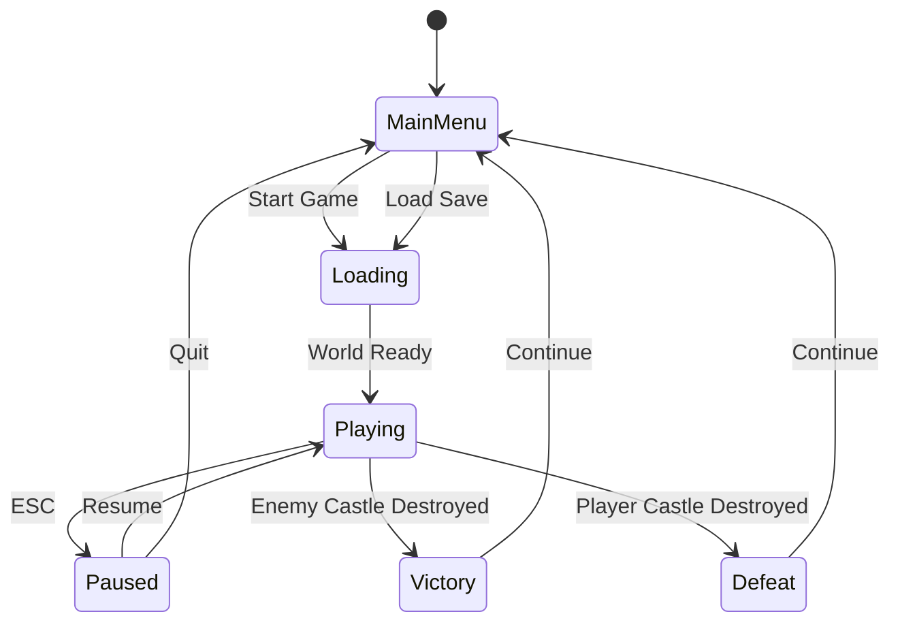
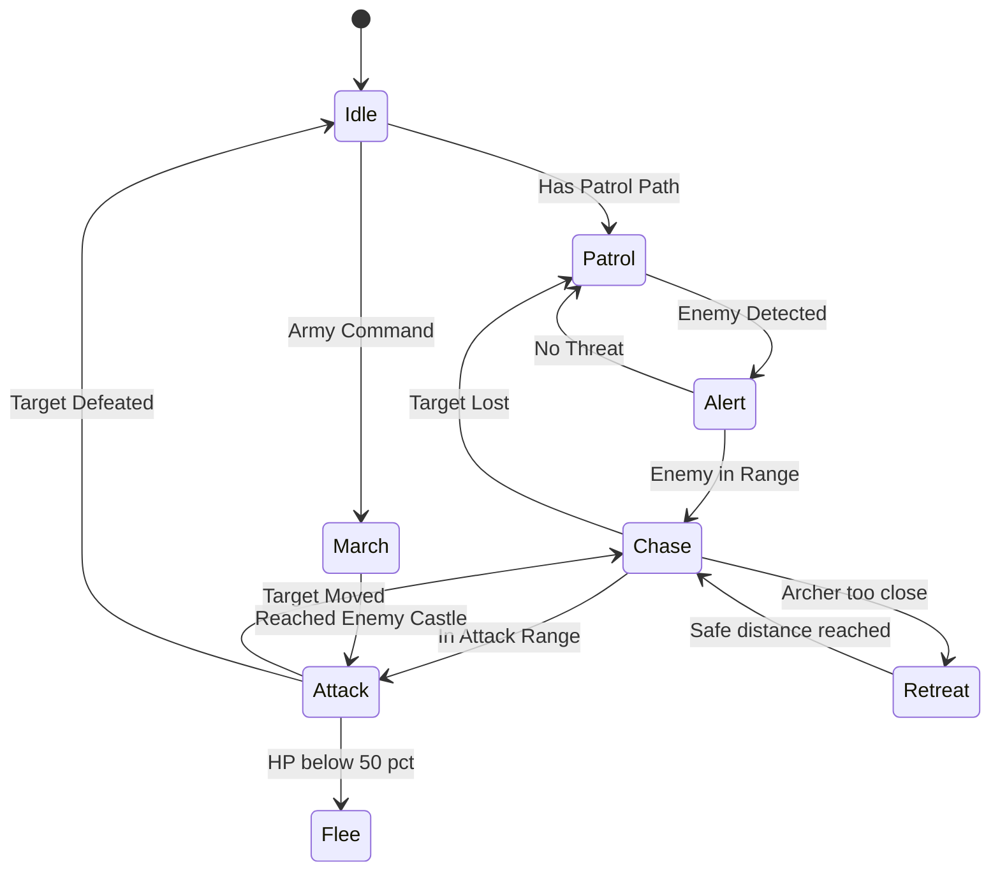
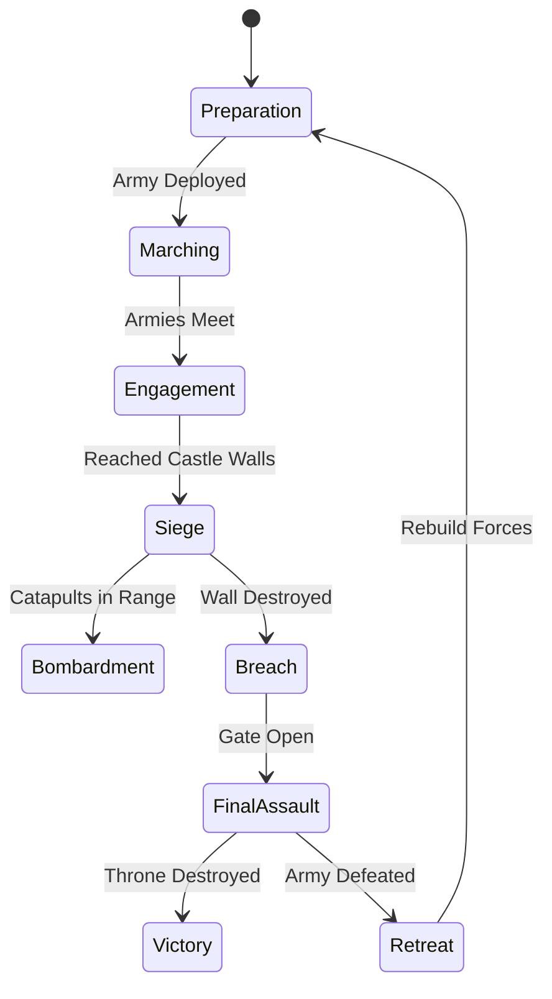

# Technical Specification — Mattis Abenteuer

## Game Constants

```typescript
// World
const CHUNK_SIZE = 16;          // blocks per chunk axis
const CHUNK_HEIGHT = 64;        // max world height in blocks
const RENDER_DISTANCE = 8;      // chunks visible in each direction
const WORLD_SEED_DEFAULT = 42;  // default world seed

// Physics
const GRAVITY = -9.81;
const PLAYER_SPEED = 5.0;       // blocks per second
const JUMP_FORCE = 6.0;
const BLOCK_SIZE = 1.0;         // world units per block

// Combat
const BASE_PLAYER_HP = 100;
const BASE_WARRIOR_HP = 50;
const MELEE_RANGE = 2.0;        // blocks
const CATAPULT_RANGE = 30.0;    // blocks
```

## Core Data Models

### Entity System

```typescript
interface Entity {
  id: string;
  position: Vector3;
  rotation: Vector3;
  components: Map<string, Component>;
}

interface Component {
  type: string;
}

interface HealthComponent extends Component {
  type: 'health';
  current: number;
  max: number;
  armor: number;
}

interface InventoryComponent extends Component {
  type: 'inventory';
  slots: (ItemStack | null)[];
  maxSlots: number;
}

interface CombatComponent extends Component {
  type: 'combat';
  damage: number;
  attackSpeed: number;
  range: number;
  lastAttackTime: number;
}

interface AIComponent extends Component {
  type: 'ai';
  state: AIState;
  target: string | null;       // entity ID
  patrolPath: Vector3[];
  alertRadius: number;
}
```

### Items & Crafting

```typescript
interface Item {
  id: string;
  name: string;
  category: ItemCategory;
  stackSize: number;
  icon: string;               // texture path
}

interface ItemStack {
  item: Item;
  count: number;
  durability?: number;
}

interface CraftingRecipe {
  id: string;
  name: string;
  ingredients: { itemId: string; count: number }[];
  result: { itemId: string; count: number };
  craftTime: number;          // seconds
  requiredStation: CraftingStation;
}

enum ItemCategory {
  BLOCK = 'block',
  TOOL = 'tool',
  WEAPON = 'weapon',
  ARMOR = 'armor',
  MATERIAL = 'material',
  SIEGE = 'siege',
  FOOD = 'food',
}

enum CraftingStation {
  HAND = 'hand',              // no workbench needed
  WORKBENCH = 'workbench',
  FORGE = 'forge',
  ARMORY = 'armory',
  SIEGE_WORKSHOP = 'siege_workshop',
}
```

### Castle System

```typescript
interface Castle {
  id: string;
  owner: 'player' | 'enemy';
  origin: Vector3;
  buildings: CastleBuilding[];
  totalHP: number;
  currentHP: number;
}

interface CastleBuilding {
  id: string;
  type: BuildingType;
  position: Vector3;
  blocks: BlockPlacement[];
  spawnsUnit: WarriorType | null;
  spawnInterval: number;       // seconds between spawns
  hp: number;
}

enum BuildingType {
  BARRACKS = 'barracks',       // spawns swordsmen
  ARCHERY_RANGE = 'archery',   // spawns archers
  STABLE = 'stable',           // spawns cavalry
  SIEGE_WORKSHOP = 'siege',    // spawns catapults
  WATCHTOWER = 'watchtower',   // increases detection range
  WALL = 'wall',               // defensive structure
  GATE = 'gate',               // entry point
  THRONE_ROOM = 'throne',      // castle core — destroy to win
}

enum WarriorType {
  SWORDSMAN = 'swordsman',
  ARCHER = 'archer',
  CAVALRY = 'cavalry',
  SHIELD_BEARER = 'shield_bearer',
  CATAPULT = 'catapult',
  CASTLE_BOSS = 'castle_boss',
}
```

### Networking

```typescript
enum MessageType {
  PLAYER_MOVE = 'PLAYER_MOVE',
  BLOCK_CHANGE = 'BLOCK_CHANGE',
  WORLD_SEED = 'WORLD_SEED',
  CHAT = 'CHAT',
  HEARTBEAT = 'HEARTBEAT',
  WARRIOR_UPDATE = 'WARRIOR_UPDATE',
  WARRIOR_REMOVE = 'WARRIOR_REMOVE',
  CASTLE_UPDATE = 'CASTLE_UPDATE',
  GAME_OVER = 'GAME_OVER',
}

interface WarriorNetState {
  id: string;
  position: Vector3;
  health: number;
  type: WarriorType;
  team: 'player' | 'enemy';
}
```

## State Machines

### Game State Machine



### Entity AI State Machine



### Combat Phase Machine



## Key Algorithms

### Terrain Generation (Simplex Noise)

```
for each (x, z) in chunk:
    base_height = SIMPLEX_2D(x * 0.01, z * 0.01) * 20 + 30
    detail = SIMPLEX_2D(x * 0.05, z * 0.05) * 5
    height = floor(base_height + detail)

    for y = 0 to height:
        if y == height:      block = GRASS
        elif y > height - 3: block = DIRT
        else:                block = STONE

    // Ore distribution
    if SIMPLEX_3D(x, y, z) > 0.7: block = IRON_ORE
    if SIMPLEX_3D(x, y, z) > 0.85: block = GOLD_ORE
    if SIMPLEX_3D(x, y, z) > 0.95: block = CRYSTAL
```

### Greedy Meshing

Optimizes voxel rendering by combining adjacent same-type faces into larger quads:

```
1. For each slice along each axis:
2.   Create a mask of visible faces
3.   Greedily expand rectangles in the mask
4.   Generate one quad per rectangle (instead of per block face)
5.   Result: dramatically fewer triangles
```

### A* Pathfinding

```
1. Start with the entity's current block position
2. Goal is the target position (enemy castle, patrol point)
3. Heuristic: Manhattan distance (good for grid-based worlds)
4. Neighbors: 4-directional on same Y, +/- 1 Y for steps
5. Cost: 1 per step, +2 for climbing, blocked if >1 height diff
6. Max search: 1000 nodes (prevent infinite searches)
```

### Enemy Castle Placement

```
1. Choose random angle from player spawn (0-360°)
2. Distance: 500-800 blocks from spawn
3. Find flat area ≥ 30×30 blocks at target
4. Generate castle structure (walls, towers, throne room)
5. Populate with guards (scaled to distance from castle center)
6. Mark on world as "undiscovered" until player gets within 50 blocks
```

## Implementation Status

| System | Status | Notes |
|---|---|---|
| Three.js renderer | ✅ Working | PCFSoftShadowMap, shadows, fog, day/night cycle, post-processing |
| Voxel engine | ✅ Working | 16³ chunks, greedy meshing, 80+ block types |
| Player controller | ✅ Working | FPS movement, AABB collision, gravity, sprint, hunger |
| World generation | ✅ Working | Simplex noise, 6 biomes, structures (dungeons, villages, ruins) |
| Crafting system | ✅ Working | 30+ recipes, Hand & Anvil stations, crafting UI |
| Combat system | ✅ Working | Melee (cone), projectiles (gravity arc), damage numbers, crits |
| Castle system | ✅ Working | 8 building types, warrior spawning, build mode, siege, castle boss |
| AI / Pathfinding | ✅ Working | A* wired to WarriorManager, 8-state AI, archer retreat logic |
| UI / HUD | ✅ Working | HUD, minimap, crafting UI, inventory UI, trading UI, base build view |
| Save / Load | ✅ Working | F5/F9, 60s auto-save, LocalStorage |
| Networking | ✅ Working | PeerJS WebRTC P2P, host-authoritative co-op |
| Effects | ✅ Working | Particles, sky dome, torch lights, weather, procedural Web Audio |
| Achievements | ✅ Working | 18 milestones with toast notifications and death screen stats |
| Village NPCs | ✅ Working | 4 professions, trade tables, recruitment, wander AI, 3D meshes |
| Base Build View | ✅ Working | 2D canvas map, fit-all zoom, rearrange, demolish 50% refund, compass, tooltips |
| Inventory UX | ✅ Working | Drag & drop, tooltips, split stack, rich item info |
| XP & Progression | ✅ Working | XP from kills/mining/crafting/quests, level-up stat bonuses |
| Farming | ✅ Working | 4 crops, growth stages, water bonus, harvest loot |
| Quest System | ✅ Working | 10 quest templates, event-driven progress, auto-refresh |
| Enchanting | ✅ Working | 6 enchantments: fire, knockback, lifesteal, speed, sharpness, fortune |
| Potions | ✅ Working | 6 potion types with active effects and duration tracking |
| Mounts | ✅ Working | Horses near villages, R-key mount/dismount, 2.5× speed |
| Ambient Sounds | ✅ Working | 7 biome-based sounds via Web Audio synthesis |
| Item Registry | ✅ Working | 75+ items (blocks, tools, weapons, armor, food, potions, dungeon loot) |
| Visual Pipeline | ✅ Working | Bloom, ACES tone mapping, per-vertex AO, height fog, wind animation, animated lava, underwater tint, dynamic crosshair, enhanced start screen |
| Weather System | ✅ Working | Per-biome rain/snow particles with smooth intensity transitions |
| Fighter Identity | ✅ Working | Team pennant flags, per-type body shapes (quiver, horse, cart, crown), shoulder plates, eye dots |
| Castle Visuals | ✅ Working | Type-specific 3D buildings: barracks (beds, weapon racks), archery range (open-air, targets), stable (fence, hay), siege workshop (iron, anvil) |
